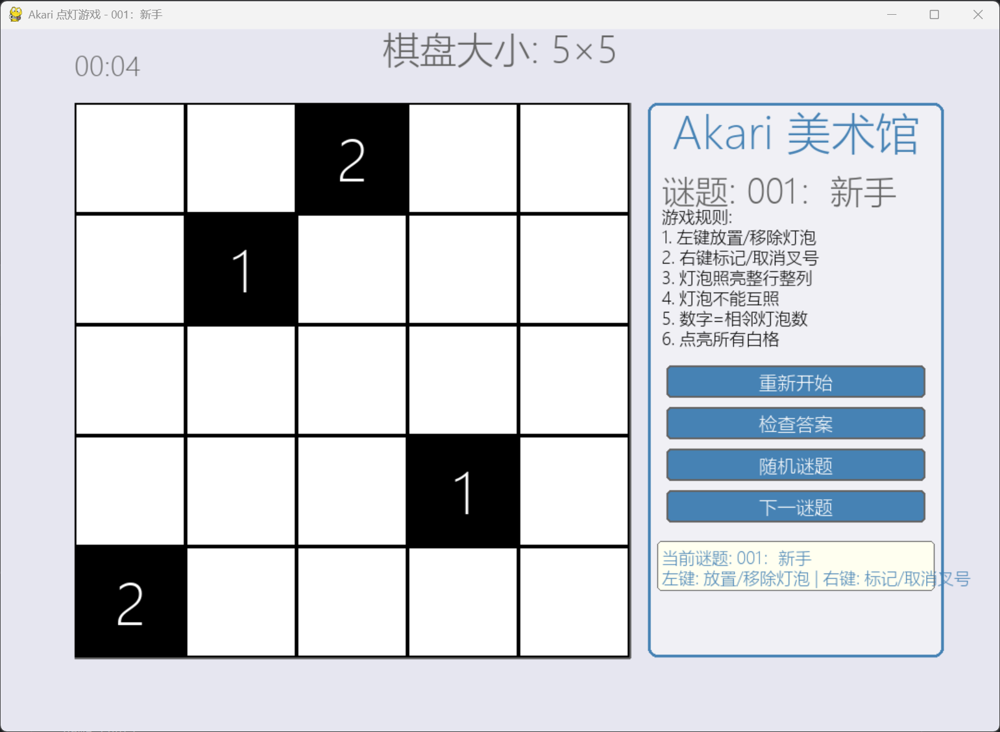

# 🎮 Akari（点灯游戏）

一个用 Python 实现的 Akari 谜题游戏。

## 📖 项目简介
本项目是《数据结构与算法》课程大作业，旨在搭建一个Akari游戏求解平台，其中有关灯泡与棋盘逻辑的部分体现了本课程学习的有关图等数据结构的知识。

## 🎯 游戏规则
Akari 是一种经典的逻辑解谜游戏，核心规则如下：

### 基本规则
1. **目标**：在白色格子中放置灯泡，照亮所有白色格子。
2. **光照规则**：灯泡会照亮其所在行和列的所有格子，直到被黑色格子阻挡。
3. **灯泡互斥**：两个灯泡不能互相照射（即同一行/列且中间无黑色格子阻挡）。
4. **数字约束**：黑色格子上的数字表示其相邻（上下左右）格子中必须放置的灯泡数量。
5. **全覆盖**：所有白色格子必须被至少一个灯泡照亮。

## 🕹️ 操作指南
在游戏界面中，您可以通过以下方式操作：

| 操作          | 功能                                       |
|---------------|--------------------------------------------|
| **左键点击**  | 在选中的格子上放置或移除灯泡               |
| **右键点击**  | 在选中的格子上标记或取消“X”（排除不可能位置） |
| **Ctrl + Z**  | 撤销上一步操作                             |
| **Ctrl + Y**  | 重做上一步操作                             |

### 按钮功能
- **重新开始**：重置当前谜题，清空所有放置的灯泡和标记。
- **检查答案**：验证当前的布局是否符合通关条件。
- **随机谜题**：打乱并生成一个全新的随机谜题。
- **下一谜题**：跳转到内置题库中的下一个关卡。

## 🚀 如何运行

### 1. 安装依赖
确保您的 Python 环境已安装必要的依赖库：

> **主要依赖：** `pygame==2.6.1`（用于创建图形界面、处理绘制与用户输入）

### 2. 启动游戏
在项目根目录打开终端执行：
gui.py

<h2>🎨 游戏界面预览</h2>

    
    

        图：Akari 点灯游戏运行界面
    

## 📂 项目结构

<pre style="font-family: 'Courier New', monospace; line-height: 1.2; color: #dcdcdc; background-color: #2d2d2d; padding: 10px; border-radius: 5px;">
Akari/
├── LICENSE            # 开源协议
├── board.py           # 核心游戏逻辑（棋盘状态、规则检查、撤销/重做）
├── gui.py             # 图形界面（Pygame渲染、交互、计时器、胜利特效）
├── puzzle_data.py     # 内置默认谜题（如 EASY_5x5）
├── puzzle_loader.py   # 从 puzzles/ 文件夹加载自定义谜题
├── puzzlink_decoder.py #将puzzlink标准akari数据格式转化成本项目可识别的数据
├── puzzles/           # 自定义谜题存放目录
│   ├── 001.py
│   ├── 002.py
│   └── ...
├── requirements.txt   # 项目依赖清单
└── README.md         # 项目说明文档
</pre>

## 🧩 自定义谜题
您可以在 puzzles/ 文件夹中添加新的谜题文件，格式如下：

### 示例代码
# puzzles/001.py
<pre style="font-family: 'Consolas', 'Monaco', 'Courier New', monospace; 
           line-height: 1.4; 
           color: #dcdcdc; 
           background-color: #2d2d2d; 
           padding: 15px; 
           border-radius: 8px; 
           overflow-x: auto;
           border: 1px solid #444;">
PUZZLE_DATA = [
    [5, 5, 2, 5, 5, 5],  # 5=白格, 1=黑格1
    [5, 1, 5, 5, 5, 5],
    [5, 5, 5, 5, 5, 2],
    [5, 5, 5, 2, 5, 5],  # 2=黑格2
    [5, 5, 5, 5, 5, 5],
    [5, 5, 2, 5, 5, 5],
]

META_INFO = {
    "name": "新手教程",
    "difficulty": "easy",  # 注意键名是 difficulty
    "size": (6, 6),       # 棋盘大小（行×列）
    "creator": "Your Name",
    "description": "适合初学者的简单谜题"
}</pre>
### 编码说明
- `5`：白色格子（可放置灯泡）
- `0-4`：带数字的黑色格子（数字表示周围需要的灯泡数）
- `-1`：无数字的黑色格子（墙壁）

## 📜 许可证
MIT License
